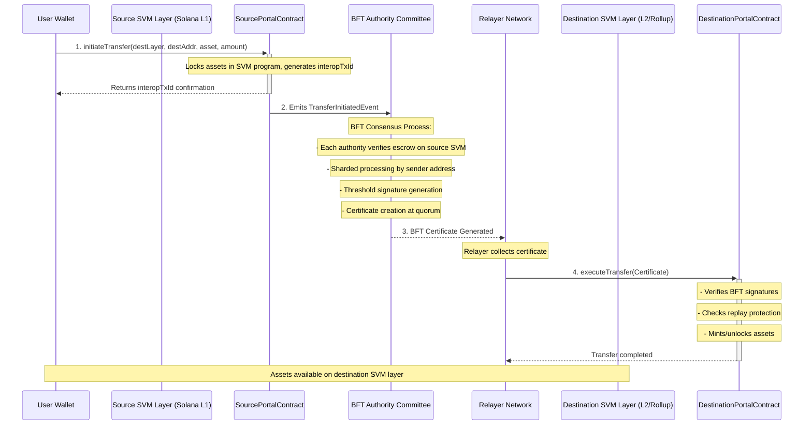

# Fast-PayTube: SVM Interoperability Layer

A high-performance, sharded interoperability protocol for SVM-based chains, enabling secure asset transfers and generalized message passing between L1 and L2 networks with Byzantine Fault Tolerance.

## Overview

Fast-PayTube is an interoperability layer designed specifically for the SVM (Solana Virtual Machine) ecosystem, enabling seamless communication between different SVM-based chains including L1s and L2s. Built on proven FastPay research, it provides Byzantine Fault Tolerant consensus with sub-second finality for both asset transfers and generalized message passing.

### The SVM Interoperability Challenge

The growing SVM ecosystem spans multiple layers and networks, but lacks efficient interoperability:

- **Asset Fragmentation**: Tokens locked in individual SVM chains
- **Composability Gaps**: DeFi protocols can't interact across SVM layers
- **Development Complexity**: Building cross-chain dApps requires custom solutions
- **Slow Settlement**: Existing solutions take minutes to hours for finality

### Our Solution

Fast-PayTube provides a unified interoperability layer for SVM chains, currently supporting asset transfers with planned expansion to generalized message passing. Built on FastPay research ([arxiv.org/abs/2003.11506](https://arxiv.org/abs/2003.11506)) and inspired by [Novi's FastPay](https://github.com/novifinancial/fastpay), it delivers:

- **Sub-second finality** for cross-chain operations
- **Byzantine fault tolerance** with 1/3 malicious authority resistance
- **Horizontal scaling** through sharded architecture
- **SVM-native design** optimized for the ecosystem

[Ceritificate Generation output](/docs/certificate-gen.png)

## Architecture



### Core Components

- **Portal Contracts**: SVM programs handling escrow and verification
- **BFT Authority Committee**: Decentralized validator network with sharded processing
- **Certificate System**: Cryptographic proofs enabling trustless verification
- **Relayer Network**: Decentralized transaction submission layer

## Getting Started

1. Clone the repository:

```bash
git clone https://github.com/your-org/fast-paytube.git
cd fast-paytube
```

2. Build the project:

```bash
cargo build --release
```

### Quick Setup

1. **Generate Configuration**:

```bash
cargo run -- generate-config --num-authorities 4 --num-shards 16 --output-dir ./bridge_config
```

2. **Start Authority Servers**:

```bash
chmod +x scripts/start_auth.sh
./scripts/start_auth.sh
```

3. **Run Relayer**:

```bash
cargo run -- relayer --committee ./bridge_config/committee.json --source-rpc 'http://localhost:3001' --destination-rpc 'http://localhost:3000'
```

## Usage

### Configuration

The interop layer uses JSON configuration files:

- `committee.json`: BFT authority committee setup
- `authority_*.json`: Individual authority configurations

### Running Components

#### Authority Server

```bash
cargo run -- server --config ./bridge_config/authority_0.json --port 8000
```

#### Relayer

```bash
cargo run -- relayer --committee ./bridge_config/committee.json --source-rpc <SOURCE_RPC> --destination-rpc <DEST_RPC>
```

#### Cleanup
```bash
pkill fast-init
```

### Environment Variables

- `RUST_LOG`: Set logging level (debug, info, warn, error)
- `SVM_CONFIG_DIR`: Override default configuration directory

**Research Foundation**: Built on [FastPay research](https://arxiv.org/abs/2003.11506) and inspired by [Novi's FastPay implementation](https://github.com/novifinancial/fastpay).
