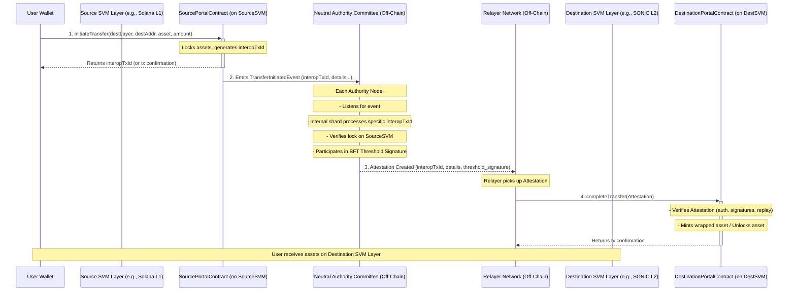

Usecase:


generate-config - 

```bash
cargo run -- generate-config --num-authorities 4 --num-shards 16 --output-dir ./bridge_config
```

run servers -

```bash
chmod +x ./scipts/start_auth.sh
./scripts/start_auth.sh
```

run relayer -

```bash
cargo run -- relayer --committee ./bridge_config/committee.json --source-rpc 'http://localhost:3001' --destination-rpc 'http://localhost:3000'
```
